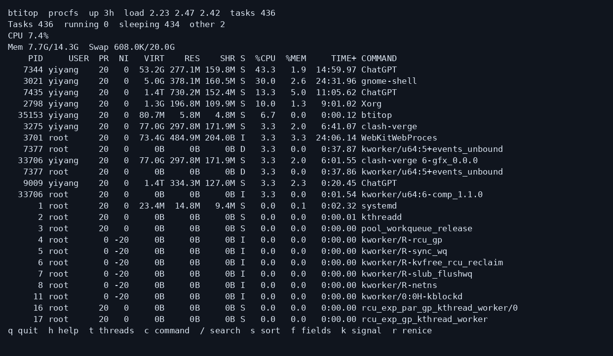

# btitop

btitop 是 Linux 终端任务监控工具，以 **BPF task iterator** 获取任务快照，并提供 procfs 备用后端和 htop 风格扫描后端。采集、指标计算、查询和界面分层实现；默认每秒采样，重点降低监控开销。



## 构建

需要 C++20 编译器、CMake、支持 BPF 的 Clang、libbpf/ libelf 开发包、ncursesw、bpftool 和内核 BTF。Ubuntu 可安装：`sudo apt install clang libbpf-dev libelf-dev libncurses-dev cmake ninja-build linux-tools-common`。定制内核的 `bpftool` 包装器若找不到工具，可向 CMake 传入 `-DBPFTOOL_EXECUTABLE=/实际路径/bpftool`。

```sh
cmake -S . -B build -G Ninja
cmake --build build
ctest --test-dir build --output-on-failure
./build/btitop
```

可使用 `sudo cmake --install build` 同时安装可执行文件和 BPF 对象；也可用 `BTITOP_BPF_OBJECT` 指定对象路径。

加载 BPF 通常需要 root 或相应权限。默认 `auto` 模式在 BPF 不可用时显示原因并改用 procfs；`sudo ./build/btitop --backend=bpf` 可要求只用 BPF。程序不会安装常驻特权服务，也不会自动修改文件 capabilities。

## 使用

```sh
./build/btitop --backend=procfs
./build/btitop --backend=htop
./build/btitop --backend=htop --threads
sudo ./build/btitop --backend=bpf --threads
./build/btitop --json --iterations=2 --interval=1
```

参数包括 `--backend=auto|bpf|procfs|htop`、`--interval`、`--pid`、`--user`、`--threads`、`--sort`、`--batch`、`--json`、`--iterations`、`--no-color`。`htop` 模式即使只显示进程行，也会遍历 `/proc/PID/task` 下的全部线程；进程视图采用进程累计 CPU 和内存，线程视图采用各线程 CPU 及共享的进程内存。这模拟 htop 的遍历方式，并非复制其全部字段语义或界面。标题与 JSON 中的 `scanned_tasks` 便于区分扫描量和展示行数。`auto` 仍在 BPF 和轻量 procfs 后端之间选择。

常用按键：`q` 退出，方向键/`j`/`K` 移动，`h` 帮助，`t` 线程模式，`c` 完整命令行，`/` 搜索，`u` 用户筛选，`p` PID 筛选，`s` 排序，`R` 反向，`z` 树视图，`f` 选择列，`I` CPU 归一化，`1` 逐核 CPU，`+`/`-` 调整刷新间隔，回车查看详情，`k` 发送信号，`r` 调整 nice。进程操作需要再次输入 `YES`。展示设置保存于 `$XDG_CONFIG_HOME/btitop/config`，未设置时使用 `~/.config/btitop/config`。

首轮 `%CPU` 显示 `N/A`。默认按 top 的 Irix 模式显示，多线程进程可超过 100%；`I` 切换为按 CPU 数归一化。BPF 的累计 CPU 值和 RSS/SHR 与 procfs 可能有小幅差异，原因与具体字段见[字段矩阵](docs/fields.md)。BPF 周期采集不扫描每任务 procfs；开启命令行显示后，只按需读取可见任务。采样间隔内出现又退出的短命任务可能被遗漏。

[架构说明](docs/architecture.md)和[性能基准](docs/benchmarks.md)包含接口、测试方法与本机结果；[场景对比](docs/comparison.md)记录了与 top、htop 的实测。当前在定制 Linux 7.0 内核上验证；标准 6.6、6.12 内核仍需各自验证。
